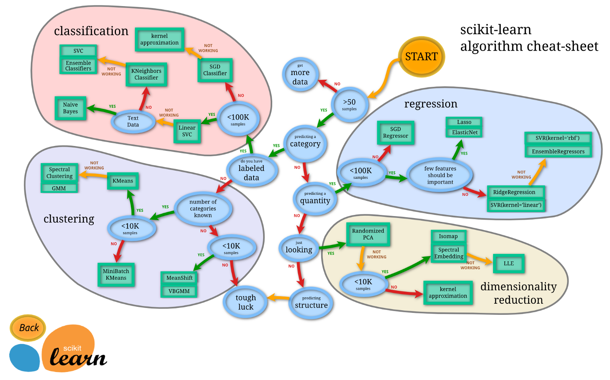

Some weeks ago I found an interesting video about _"How to learn Machine Learning in 6
 months"_ and needless to say I was pretty excited about that.  

### **Roadmap: How to Learn Machine Learning in 6 Months**  
  

I have been reading and watching a lot of videos about the subject but by the time this post is being written 
I haven't done any projects related to machine learning besides a bag of words program for a course at the university
and simple web scrappers.  

I have decided I **will** follow Zach Miller's advice so I can finally learn Machine Learning!

### What to do

I will have to study again:
- Linear Algebra
- Calculus
- Statistics
- Probability

I have already picked a language:
- Python

I have already collected a lot of books and tutorials to help me with the ML theory so I will post about 
the ones I found useful and I will be thinking about the projects I want to make.

Hopefully everything will be just fine and every month I will post about my progress and challenges.

So I will do what Zach recommends to do: 

## _**JUST BUILD SOMETHING WITH DATA**_